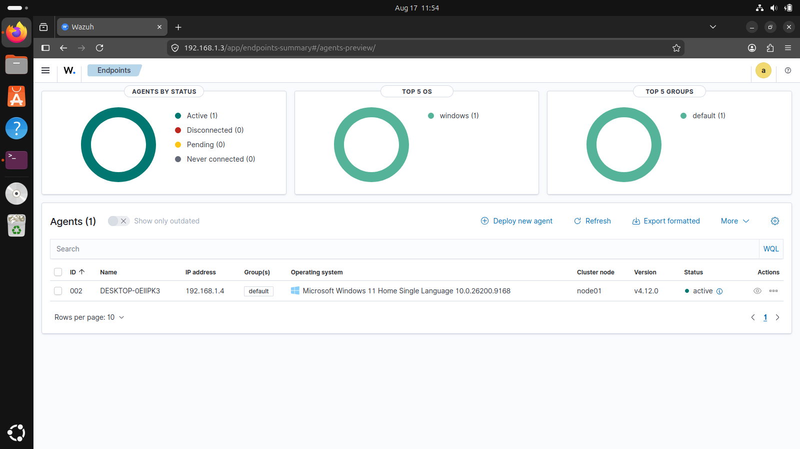
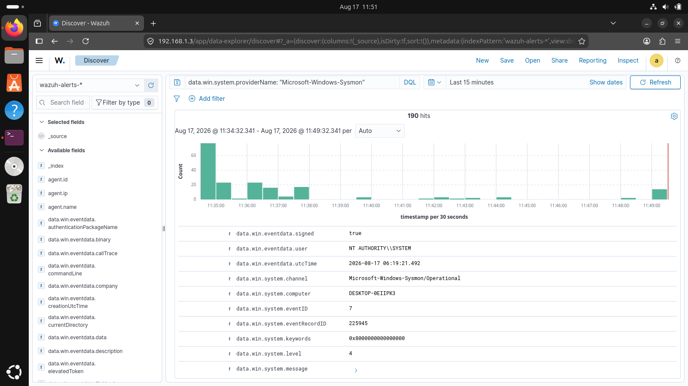
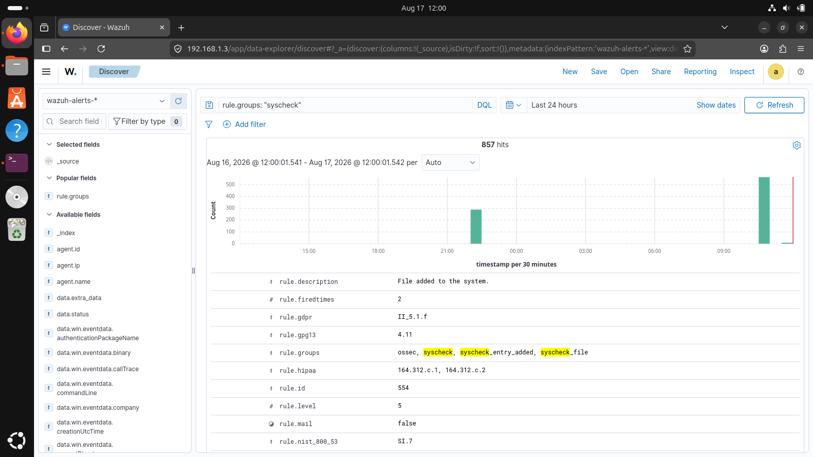
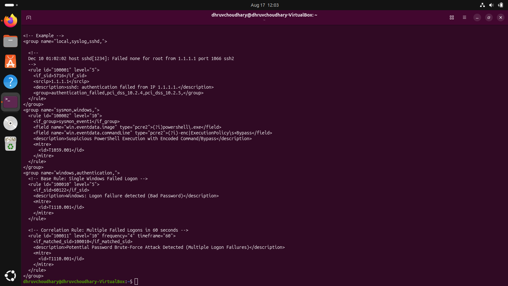
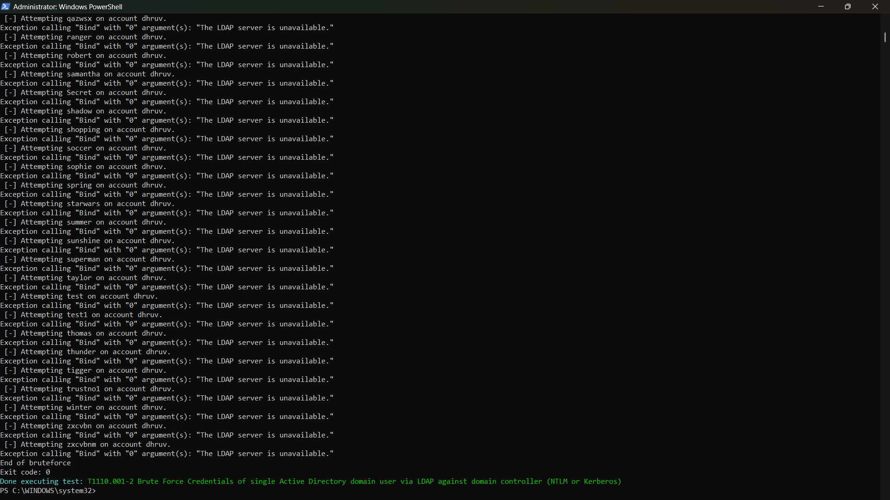
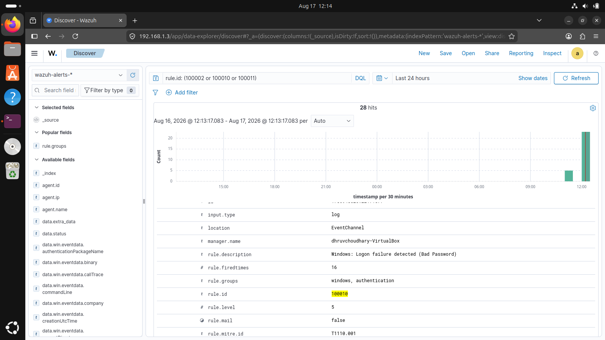

# 🛡️ Enterprise Detection Engineering & SOC Telemetry Lab
### Wazuh SIEM | Microsoft Sysmon | Atomic Red Team Adversary Emulation | MITRE ATT&CK Mapping

---

## 📌 Executive Summary
This project demonstrates an end-to-end Security Operations Center (SOC) detection engineering environment[cite: 3]. The lab covers kernel-level Windows telemetry collection using Microsoft Sysmon, real-time File Integrity Monitoring (FIM), custom XML/PCRE2 correlation rules engine deployment, and detection validation through Atomic Red Team adversary emulation mapped to the MITRE ATT&CK Enterprise Matrix[cite: 3].

---

## 📐 Architecture & Network Topology

+-----------------------------------------------------------------------------------------------+
|                                     LAB NETWORK (192.168.1.0/24)                              |
|                                                                                               |
|   +---------------------------------------+           +-----------------------------------+   |
|   |         WINDOWS 11 ENDPOINT           |           |       WAZUH ALL-IN-ONE SERVER     |   |
|   |            192.168.1.4                |           |         (Ubuntu 22.04 LTS)        |   |
|   |                                       |           |            192.168.1.3            |   |
|   |  - Microsoft Sysmon (Events 1, 7, 10) |           |  - Wazuh Manager (Analysis Engine)|   |
|   |  - Wazuh Agent v4.12.0 (TLS Encrypted)|---------->|  - Wazuh Indexer (OpenSearch DB)  |   |
|   |  - Real-Time Syscheck (FIM) Engine    |   :1514   |  - Wazuh Dashboard (HTTPS Web GUI)|   |
|   |  - Atomic Red Team Testing Framework  |   :1515   |  - Custom Correlation Rules Engine|   |
|   +---------------------------------------+           +-----------------------------------+   |
+-----------------------------------------------------------------------------------------------+

---

## 🛠️ Key Implementations

### 1. Telemetry Ingestion & Filtering
* Microsoft Sysmon: Configured Microsoft-Windows-Sysmon/Operational channel to capture deep endpoint telemetry, including process creation with full command lines (Event ID 1) and dynamic image/DLL loading (Event ID 7)[cite: 3].
* Windows Security Logs: Forwarded Security event channel with query filters to isolate authentication activity and suppress noisy event IDs[cite: 3].

### 2. Real-Time File Integrity Monitoring (FIM)
* Configured the Wazuh syscheck engine with realtime="yes", check_all="yes", and report_changes="yes" on critical system binaries, Windows Startup directories, and custom folders to track file modifications, additions, and hash changes[cite: 3].

### 3. Custom Detection Engineering (local_rules.xml)
* Rule 100002 (T1059.001): PCRE2 regex inspection on win.eventdata.commandLine detecting PowerShell execution policy bypasses (-ExecutionPolicy Bypass) and obfuscated Base64 payloads (-enc)[cite: 3].
* Rule 100010 (T1110.001): Base rule capturing Windows Event ID 4625 (Logon failure due to bad password)[cite: 3].
* Rule 100011 (T1110.001): Frequency-based correlation rule aggregating 4 or more logon failures within 60 seconds to detect active credential brute-force attempts[cite: 3].

---

## 🎯 Adversary Emulation & Detections Validated

| MITRE ATT&CK ID | Technique Name | Simulation Method | Triggered Rule / Severity |
| :--- | :--- | :--- | :--- |
| T1059.001[cite: 3] | PowerShell Bypass[cite: 3] | Native CLI Bypass & Base64 Payload[cite: 3] | Rule 100002 (Level 10)[cite: 3] |
| T1110.001[cite: 3] | Brute Force (Logon Guessing)[cite: 3] | Atomic Red Team (T1110.001-2) & Loop[cite: 3] | Rule 100010 / 100011 (Level 10)[cite: 3] |
| T1547.001[cite: 3] | Registry Run Keys Persistence[cite: 3] | FIM Syscheck Registry Monitoring[cite: 3] | Syscheck Rule 550 / 554 (Level 5)[cite: 3] |

---

## 📸 Lab Evidence & Screenshots

### 1. Wazuh Agent Enrollment & Active Connectivity
Verified real-time communication between Windows 11 endpoint (192.168.1.4) and Wazuh Server (192.168.1.3) over mutual TLS[cite: 3].
[cite: 3]

### 2. Granular Sysmon Telemetry Stream
Ingested live Sysmon operational logs displaying detailed metadata including process details and Image/DLL loading (Event ID 7)[cite: 3].
[cite: 3]

### 3. File Integrity Monitoring (Syscheck Detection)
Real-time FIM alerts triggering on file additions and modifications (Rule 554 - File added to system)[cite: 3].
[cite: 3]

### 4. Custom Detection Rules Configuration
Engineered custom XML detection and correlation rules in /var/ossec/etc/rules/local_rules.xml[cite: 3].
[cite: 3]

### 5. Adversary Simulation Execution (Atomic Red Team)
Simulated adversary attack techniques against the endpoint using the Atomic Red Team execution framework (T1110.001-2)[cite: 3].
[cite: 3]

### 6. SOC Alert Triage in Wazuh Discover
Correlated high-fidelity alerts triaged inside the Wazuh Dashboard mapped directly to MITRE ATT&CK ID T1110.001[cite: 3].
[cite: 3]

---

## 📂 Repository Structure

Wazuh-SOC-Detection-Engineering-Lab/
├── README.md
├── config/
│   └── agent_ossec.conf          # Windows Wazuh Agent configuration[cite: 3]
├── rules/
│   └── local_rules.xml           # Custom PCRE2 & correlation rules[cite: 3]
└── screenshots/
    ├── 01_wazuh_agent_active.png
    ├── 02_sysmon_telemetry.png
    ├── 03_fim_integrity_monitoring.png
    ├── 04_custom_xml_rules.png
    ├── 05_adversary_simulation.png
    └── 06_mitre_attack_alert.png

---

## ⚙️ Tools & Technologies Used

* SIEM / XDR Platform:
  * Wazuh Manager (v4.12.0): Centralized log analysis, decoder/rules engine, and alert generation[cite: 3].
  * Wazuh Indexer: High-performance distributed search engine (OpenSearch-based) for log storage and indexing[cite: 3].
  * Wazuh Dashboard: Web GUI for security analytics, visual histograms, and SOC alert triage[cite: 3].
  * Wazuh Agent (Windows): Lightweight endpoint daemon shipping event channels over TLS port 1514[cite: 3].

* Endpoint Telemetry & Monitoring:
  * Microsoft Sysmon (System Monitor 64-bit): Deep host-level visibility capturing Event ID 1 (Process Creation), Event ID 7 (Image Loaded), and Event ID 10 (Process Access)[cite: 3].
  * Windows Event Viewer & Channels: Microsoft-Windows-Sysmon/Operational, Security (Audit Logs / Event ID 4625), System, and Application[cite: 3].
  * Wazuh Syscheck (FIM): Real-time directory integrity monitoring with SHA256/MD5 hashing and registry modification tracking[cite: 3].

* Adversary Emulation & Testing:
  * Atomic Red Team (Invoke-AtomicRedTeam): Scripted execution framework used for adversary emulation and MITRE technique validation[cite: 3].
  * PowerShell 7 / Windows PowerShell: Command-line interpreter used for execution policy bypass simulation and authentication stress-testing[cite: 3].

* Detection Engineering Standards & Protocols:
  * MITRE ATT&CK Enterprise Matrix: Threat-informed framework mapping detections across Tactics (Execution, Credential Access, Persistence)[cite: 3].
  * PCRE2 (Perl Compatible Regular Expressions): Advanced pattern-matching regex used in XML rule creation for command-line string inspection.
  * Virtualization & Networking: Oracle VirtualBox with Bridged Networking adapters enabling seamless multi-node routing[cite: 3].